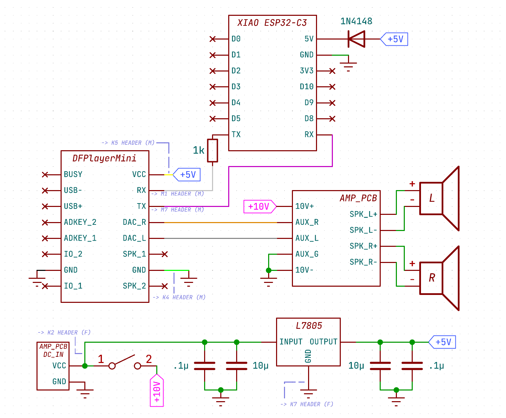

# WhiteNoiseMachine

Severance-themed device used to play white noise. Part of Delaney's 2025 Christmas gifts.

## Schematic

## Wiring Notes
### DC Input PCB *(AMP_PCB DC_IN)*
> - `VCC` -> Switch, L7805 *`INPUT`* (via solid wire to *`K2`* female header)
> - `GND` -> L7805 *`GND`* (via solid wire to *`K7`* female header)

### Amplifier PCB *(AMP_PCB)*
> - `10V+` -> Switch
> - `10V-` -> L7805 *`GND`* (via solid wire to *`K3`* female header)
> - `AUX_G` -> *`10V-`* solder point (via solid wire)
> - `AUX_R` -> DFPlayerMini *`DAC_R`* (via stripped **ORANGE** female-to-female jumper)
> - `AUX_L` -> DFPlayerMini *`DAC_L`* (via stripped **GREY** female-to-female jumper)
> - `SPK_L+` -> Left speaker positive terminal (direct soldered)
> - `SPK_L-` -> Left speaker negative terminal (direct soldered)
> - `SPK_R+` -> Right speaker positive terminal (direct soldered)
> - `SPK_R-` -> Right speaker negative terminal (direct soldered)

### DFPlayerMini
> - `VCC` -> L7805 *`OUTPUT`* (via **YELLOW** female-to-female jumper to *`K5`* header)
> - `RX` -> ESP32 *`TX`* (via **WHITE** female-to-female jumper to *`M1`* header)
> - `TX` -> ESP32 *`RX`* (via **PURPLE** female-to-female jumper to *`M7`* header)
> - `GND` -> L7805 *`GND`* (via **GREEN** female-to-female jumper to *`K4`* header)

### XIAO ESP32-C3
> - `5V` -> L7805 *`OUTPUT`* (direct soldered, through diode)
> - `GND` -> L7805 *`GND`* (direct soldered)
> - `RX` -> DFPlayerMini *`TX`* (via **PURPLE** female-to-female jumper)
> - `TX` -> DFPlayerMini *`RX`* (via **WHITE** female-to-female jumper)

### L7805
> - `INPUT` -> DC Input PCB *`VCC`* (via solid wire to *`K2`* female header)
> - `OUTPUT` -> ESP32 *`5V`* (direct soldered, through diode), DFPlayerMini *`VCC`* (via **YELLOW** female-to-female jumper to *`K5`* header)
> - `GND` -> Star-point, common to all other grounds